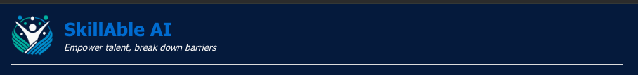
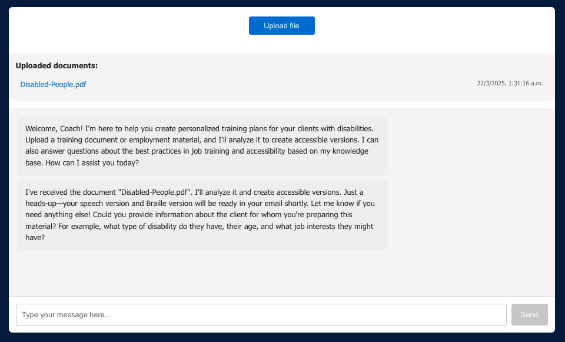
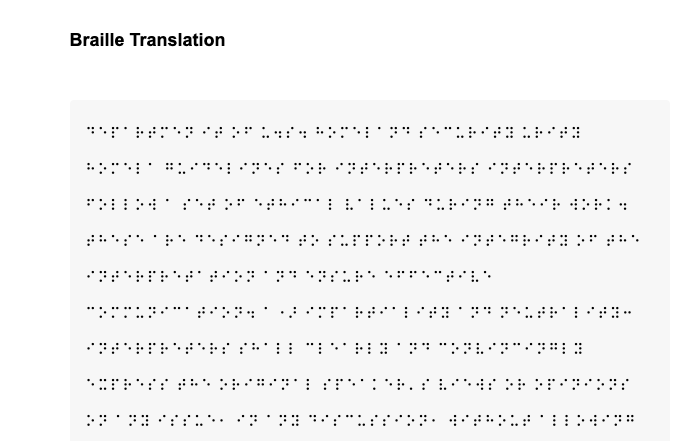
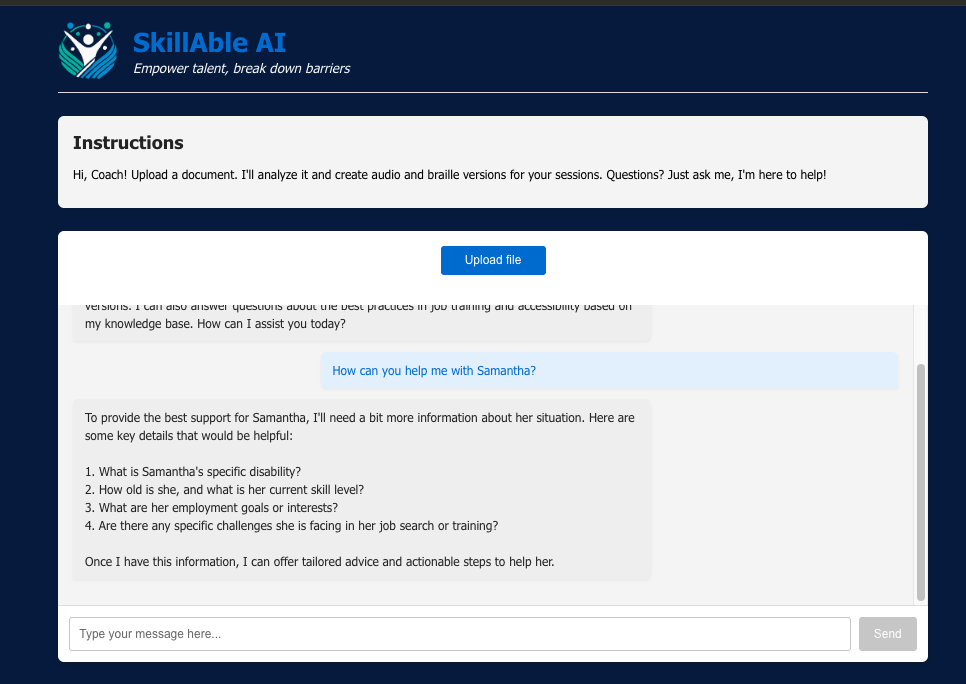
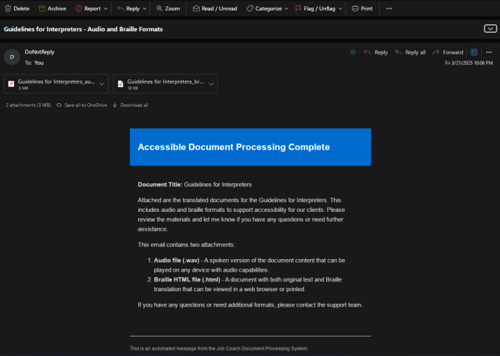
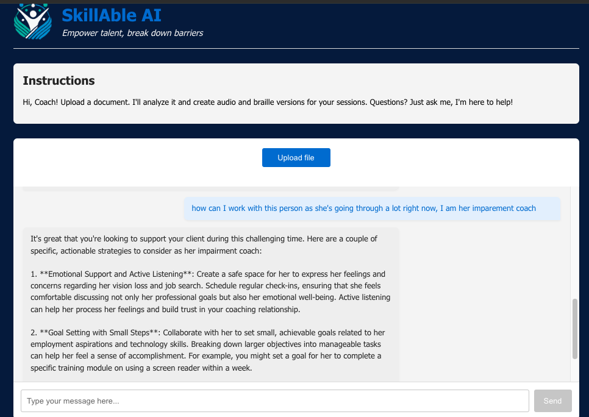

# SkillAble AI - Setup Guide



SkillAble AI is a React application that helps job coaches work with clients who have disabilities. This guide will help you set up and deploy the application.

## Table of Contents
- [Environment Variables Setup](#environment-variables-setup)
- [Backend Setup](#backend-setup)
- [Local Development Setup](#local-development-setup)
- [Features and Functionality](#features-and-functionality)
- [Azure Blob Storage CORS Configuration](#azure-blob-storage-cors-configuration)
- [Deploying as an Azure Web App](#deploying-as-an-azure-web-app)

## Environment Variables Setup

The application requires several environment variables to connect to Azure services. Create a `.env` file in the root directory with the following variables:

```
# Azure OpenAI Configuration
REACT_APP_AZURE_AI_ENDPOINT=https://your-azure-openai-resource.openai.azure.com
REACT_APP_AZURE_DEPLOYMENT_NAME=your-deployment-name
REACT_APP_AZURE_AI_KEY=your-azure-openai-key

# Azure Blob Storage Configuration
REACT_APP_STORAGE_URL=https://yourstorageaccount.blob.core.windows.net/
REACT_APP_CONTAINER_NAME=your-container-name
REACT_APP_SAS_TOKEN=?sv=2022-11-02&ss=b&srt=sco&sp=rwdlacitfx&se=2025-03-21T00:00:00Z&st=2024-03-22T00:00:00Z&spr=https&sig=yoursastoken
```

### How to obtain these values

1. **Azure OpenAI Setup:**
   - Create an Azure OpenAI resource in the Azure portal
   - Deploy a model in your Azure OpenAI resource
   - From the Azure OpenAI resource page:
     - Get the endpoint URL for `REACT_APP_AZURE_AI_ENDPOINT`
     - Get the API key for `REACT_APP_AZURE_AI_KEY`
     - Use your model deployment name for `REACT_APP_AZURE_DEPLOYMENT_NAME`

2. **Azure Blob Storage Setup:**
   - Create a Storage Account in Azure portal
   - Create a container named for your documents
   - For `REACT_APP_STORAGE_URL`, use your storage account URL
   - For `REACT_APP_CONTAINER_NAME`, use the container name you created
   - To generate a SAS token for `REACT_APP_SAS_TOKEN`:
     - Go to your storage account → Shared access signature
     - Configure permissions (at minimum: Read, Write, Create)
     - Set start and expiry dates
     - Generate SAS and connection string
     - Copy only the SAS token part (including the ? prefix)

## Backend Setup

This application requires a backend service to function properly. The backend handles document processing, AI model integration, and other server-side functions.

### Setting up the Backend

1. **Clone the backend repository:**
   ```bash
   git clone https://github.com/crissins/SkillAble-AI-Backend.git
   cd SkillAble-AI-Backend
   ```

2. **Follow the setup instructions in the backend repository**
   - The backend repository contains detailed instructions for:
     - Setting up required Azure services
     - Configuring environment variables
     - Deploying the backend services
     - Connecting to Azure OpenAI and Blob Storage

3. **Note the backend API endpoints**
   - After setting up the backend, note the API endpoints
   - You'll need these to configure the frontend application

For complete backend documentation and setup instructions, visit:
[https://github.com/crissins/SkillAble-AI-Backend](https://github.com/crissins/SkillAble-AI-Backend)

## Local Development Setup

1. **Clone the repository:**
   ```bash
   git clone https://github.com/your-username/skillable-ai.git
   cd skillable-ai
   ```

2. **Install dependencies:**
   ```bash
   npm install
   ```

3. **Create the `.env` file as described above**

4. **Start the development server:**
   ```bash
   npm start
   ```

5. **Access the application:**
   Open your browser and navigate to `http://localhost:3000`

## Features and Functionality

SkillAble AI provides a comprehensive set of tools designed to help job coaches work more effectively with clients who have disabilities. The application offers the following key features:

### Intelligent Assistant for Job Coaches



- **AI-Powered Support**: Specialized AI assistant that understands supported employment practices and disability accommodation needs
- **Context-Aware Conversations**: The system tracks client information and provides personalized guidance based on specific client needs
- **Targeted Follow-Up Questions**: Automatically identifies missing information and asks relevant questions to gather complete client profiles

### Document Management and Accessibility



- **Document Upload**: Support for PDF, DOC, DOCX, and TXT file formats
- **Accessible Document Creation**: Automatically analyzes training materials and employment documents to create accessible versions
- **Braille and Audio Conversion**: Converts uploaded materials into formats suitable for clients with visual impairments

### Client Information Management



- **Automatic Client Profile Creation**: Extracts and organizes client information from conversations
- **Client Details Tracking**: Maintains profiles including:
  - Disability type and specific needs
  - Age and relevant demographic information
  - Job interests and career goals
  - Skill level and medical conditions
  - Employment history and preferences

### Personalized Employment Support



- **Tailored Recommendations**: Provides specific, actionable advice based on individual client circumstances
- **Disability-Specific Guidance**: Offers accommodation suggestions and strategies appropriate for different disabilities
- **Job Matching Assistance**: Helps identify suitable employment opportunities based on client strengths and limitations

### Workflow Optimization



- **Progress Tracking**: Monitors client development and training milestones
- **Resource Suggestions**: Recommends relevant tools, techniques, and materials based on client needs
- **Time-Saving Automation**: Reduces administrative tasks through intelligent document handling and information extraction

### User Interface
- **Clean, Intuitive Design**: Easy-to-use interface designed for job coaches' workflow
- **Real-Time Chat**: Instant responses and guidance from the AI assistant
- **Document Storage**: Maintains a library of uploaded documents for easy reference
- **Responsive Layout**: Works on desktop and mobile devices for coaching on-the-go

The application serves as a comprehensive tool to help job coaches increase their efficiency, provide more personalized support, and ultimately improve employment outcomes for clients with disabilities.

## Azure Blob Storage CORS Configuration

To allow the application to upload files to Azure Blob Storage from your local development environment, you need to configure CORS:

1. **Using Azure Portal:**
   - Go to your Storage Account in the Azure portal
   - Select "Resource sharing (CORS)" from the left menu under "Settings"
   - Click "+ Add Rule" and configure:
     - Allowed origins: `http://localhost:3000` (for local development)
     - Allowed methods: Select all (DELETE, GET, HEAD, MERGE, POST, OPTIONS, PUT)
     - Allowed headers: `*`
     - Exposed headers: `*`
     - Max age: `86400` (or your preferred value)
   - Click "Save"

2. **Using Azure CLI:**
   ```bash
   az storage cors add --account-name yourstorageaccount \
     --origins "http://localhost:3000" "https://your-production-domain.com" \
     --methods DELETE GET HEAD MERGE POST OPTIONS PUT \
     --allowed-headers "*" \
     --exposed-headers "*" \
     --max-age 86400
   ```

3. **For production deployment:**
   - Make sure to add your production URL to the allowed origins as well

## Deploying as an Azure Web App

1. **Create an Azure Web App:**
   - Go to the Azure portal
   - Create a new Web App resource
   - Select "Node.js" as the runtime stack
   - Choose your preferred App Service Plan

2. **Configure environment variables:**
   - In your Web App resource, go to "Configuration" under "Settings"
   - Add all environment variables listed above as "Application settings"
   - Click "Save"

3. **Deploy using GitHub Actions (recommended):**
   - In your GitHub repository, set up the following secrets:
     - `AZURE_WEBAPP_NAME`: The name of your Azure Web App
     - `AZURE_WEBAPP_PUBLISH_PROFILE`: Your publish profile content from Azure
   - Create a GitHub Actions workflow file (`.github/workflows/azure-deploy.yml`):

   ```yaml
   name: Deploy to Azure Web App

   on:
     push:
       branches:
         - main

   jobs:
     build-and-deploy:
       runs-on: ubuntu-latest
       steps:
         - uses: actions/checkout@v2

         - name: Set up Node.js
           uses: actions/setup-node@v2
           with:
             node-version: '16.x'

         - name: npm install and build
           run: |
             npm install
             npm run build

         - name: Deploy to Azure Web App
           uses: azure/webapps-deploy@v2
           with:
             app-name: ${{ secrets.AZURE_WEBAPP_NAME }}
             publish-profile: ${{ secrets.AZURE_WEBAPP_PUBLISH_PROFILE }}
             package: ./build
   ```

4. **Alternative deployment methods:**
   
   **Using Visual Studio Code:**
   - Install the Azure App Service extension
   - Sign in to your Azure account
   - Right-click on your Web App and select "Deploy to Web App"
   - Choose your build folder (typically `./build`)

   **Using Azure CLI:**
   ```bash
   # Build your React app
   npm run build
   
   # Deploy using Azure CLI
   az webapp deployment source config-zip -g YourResourceGroup -n YourWebAppName --src ./build.zip
   ```

5. **Verify CORS settings for production:**
   - Make sure to add your Web App URL to the allowed origins in the Azure Blob Storage CORS settings

## Troubleshooting

- **CORS issues**: If you encounter CORS errors, verify your CORS settings in Azure Blob Storage and ensure all origins, methods, and headers are properly configured.
- **Storage access issues**: Verify that your SAS token is valid and has the necessary permissions.
- **OpenAI API issues**: Check that your Azure OpenAI service is properly provisioned and that your deployment is active.

## Additional Resources

- [Azure OpenAI Documentation](https://learn.microsoft.com/en-us/azure/cognitive-services/openai/)
- [Azure Blob Storage Documentation](https://learn.microsoft.com/en-us/azure/storage/blobs/)
- [React Documentation](https://reactjs.org/docs/getting-started.html)
- [Azure Web Apps Documentation](https://learn.microsoft.com/en-us/azure/app-service/)
